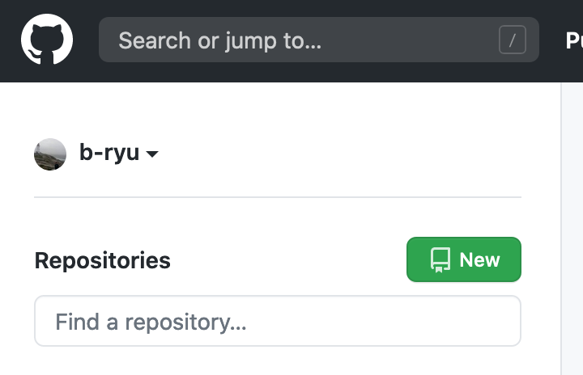
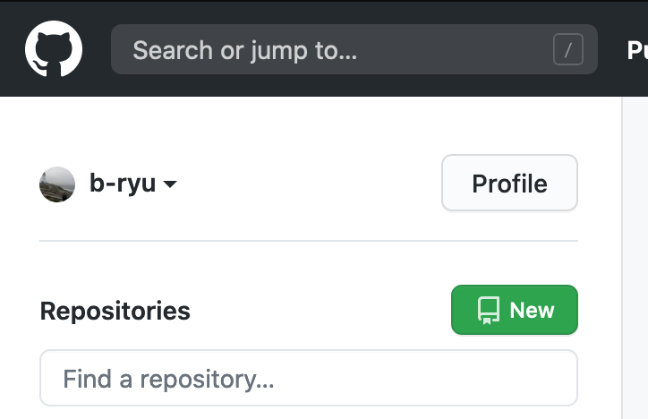

# Git-PP

A simple browser extension for changing the GitHub homepage UI.

Namely, adding a button that takes you to your profile page in a single click.

## Links

- [Firefox](https://addons.mozilla.org/en-CA/firefox/addon/git-pp/)

## Screenshots

### Firefox

| Before                              | After                              |
| ----------------------------------- | ---------------------------------- |
|  |  |
